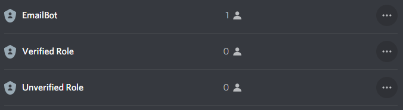

<!--
*** Build using the Best-README-Template.
-->
<!-- PROJECT LOGO -->
<br />
<p align="center">
<a></a>
  <h3 align="center">Discord Email Verify</h3>
  <p align="center">
    A powerful Email Verification Bot for Discord servers<br />
    <p align="center">
  <a href="https://github.com/lkaesberg/EmailVerify/actions"></a>
  <a href="https://github.com/lkaesberg/EmailVerify/blob/main/LICENSE"></a>
  <a href="https://github.com/lkaesberg/EmailVerify/network/members"></a>
  <a href="https://github.com/lkaesberg/EmailVerify/stargazers"></a>
</p>
    <p>
    <a href="https://github.com/lkaesberg/EmailBot/issues">Report Bug</a>
    ·
    <a href="https://github.com/lkaesberg/EmailBot/issues">Request Feature</a>
    </p>
    <a href="https://emailbot.larskaesberg.de/">🌐 Website</a>
  </p>
</p>

---

<!-- TABLE OF CONTENTS -->
<details open="open">
  <summary><h2 style="display: inline-block">📋 Table of Contents</h2></summary>
  <ol>
    <li><a href="#-about">About</a></li>
    <li><a href="#-built-with">Built With</a></li>
    <li><a href="#-usage">Usage</a></li>
    <li><a href="#-commands">Commands</a></li>
    <li>
      <a href="#-self-hosting">Self Hosting</a>
      <ul>
        <li><a href="#docker-recommended">Docker (Recommended)</a></li>
        <li><a href="#manual-installation">Manual Installation</a></li>
      </ul>
    </li>
    <li><a href="#-contributors">Contributors</a></li>
    <li><a href="#-support-the-project">Support the Project</a></li>
  </ol>
</details>

---

## 📖 About

This bot verifies that a Discord user owns an email address with a specific domain (e.g., verify `name@university.edu` emails). This is useful for servers that need to restrict access to verified members only, such as:

- **University/College servers** - Verify students with `.edu` emails
- **Company servers** - Verify employees with corporate emails
- **Organization servers** - Verify members with organization emails

### How it works:
1. User clicks a verification button
2. Bot sends a DM asking for their email address
3. A verification code is sent to the email
4. User enters the code to receive the verified role

---

## 🚀 Usage

### Invite the Bot

Use this link to invite the bot to your server:

[](https://discord.com/api/oauth2/authorize?client_id=895056197789564969&permissions=268504128&scope=bot%20applications.commands)

### Quick Setup

1. **Invite the bot** using the link above
2. **Set the verified role**: `/role verified @YourVerifiedRole`
3. **Add allowed domains**: `/domain add @university.edu` (use `@*.edu` for all .edu domains)
4. **Create a verification button**: `/button #verification-channel "Click to Verify"`
5. Done! Users can now verify themselves

---

## 📝 Commands

### 👤 User Commands

| Command | Description |
|---------|-------------|
| `/verify` | Start the email verification process |
| `/data delete-user` | Delete your verification data and remove verified status |

### 👥 Role Configuration

| Command | Description |
|---------|-------------|
| `/role verified [role]` | Set or view the role given after verification |
| `/role unverified [role]` | Set or view the optional role for unverified members |

### 📧 Domain Management

| Command | Description |
|---------|-------------|
| `/domain add <domains>` | Add allowed email domains (supports `*` wildcard) |
| `/domain remove <domains>` | Remove allowed domains |
| `/domain list` | View all allowed domains |
| `/domain clear` | Remove all allowed domains |

> 💡 **Wildcard Example:** Use `@*.edu` to allow any `.edu` email address

### 🚫 Blacklist Management

| Command | Description |
|---------|-------------|
| `/blacklist add <emails>` | Block specific emails or patterns from verifying |
| `/blacklist remove <emails>` | Unblock emails or patterns |
| `/blacklist list` | View all blacklisted entries |
| `/blacklist clear` | Remove all blacklist entries |

### ⚙️ Settings

| Command | Description |
|---------|-------------|
| `/settings language <lang>` | Change the bot's language |
| `/settings log-channel [channel]` | Set or disable the verification log channel |
| `/settings verify-message [message]` | Set or reset custom message in verification emails |
| `/settings auto-verify <enable>` | Auto-prompt new members to verify on join |
| `/settings auto-unverified <enable>` | Auto-assign unverified role to new members |

### 🛡️ Moderation & Setup

| Command | Description |
|---------|-------------|
| `/button <channel> <buttontext>` | Create a verification button embed in a channel |
| `/manualverify <user> <email>` | Manually verify a user without email confirmation |
| `/set_error_notify` | Configure where error notifications are sent |

### 📊 Information

| Command | Description |
|---------|-------------|
| `/status` | View bot configuration, statistics, and check for issues |
| `/help` | Show setup instructions and command overview |

### ⚠️ Data Management

| Command | Description |
|---------|-------------|
| `/data delete-user` | Delete your personal verification data |
| `/data delete-server` | Delete all server data and remove the bot |

> ⚠️ **Note:** Most commands require administrator permissions

### Important: Role Hierarchy

The EmailBot role **must be higher** in the role hierarchy than the verified and unverified roles, otherwise you'll get a `Can't find roles. Please contact the admin!` error.

<p align="center">
  
</p>

---

## 🐳 Self Hosting

If you want to self-host the bot, you have two options: **Docker** (recommended) or **Manual Installation**.

> 💖 **Enjoying the bot?** If you find this project useful, please consider [buying me a pizza](https://www.buymeacoffee.com/sral12486) to support ongoing development!

### Docker (Recommended)

The easiest way to self-host is using Docker with the pre-built image.

#### 1. Create a directory for the bot
```bash
mkdir emailverify && cd emailverify
```

#### 2. Create the config file
```bash
mkdir config
nano config/config.json
```

Add your configuration:
```json
{
  "token": "<Discord Bot Token>",
  "clientId": "<Discord Bot Client ID>",
  "email": "<Email Address>",
  "username": "<Mail Server Username>",
  "password": "<Email Password>",
  "smtpHost": "<SMTP Server>",
  "isGoogle": false
}
```

#### 3. Create docker-compose.yml
```yaml
version: '3'
services:
  emailverify:
    image: ghcr.io/lkaesberg/emailverify:latest
    ports:
      - 8181:8181
    volumes:
      - ./config:/usr/app/config
    restart: always
```

#### 4. Start the bot
```bash
docker-compose up -d
```

#### Docker CLI Alternative
```bash
docker run -d \
  --name emailverify \
  -p 8181:8181 \
  -v $(pwd)/config:/usr/app/config \
  --restart always \
  ghcr.io/lkaesberg/emailverify:latest
```

---

### Manual Installation

**Requirements:** Node.js v16.15.0 or higher

#### 1. Clone the repository
```bash
git clone https://github.com/lkaesberg/EmailVerify.git
cd EmailVerify
```

#### 2. Create the config file
```bash
nano config/config.json
```

```json
{
  "token": "<Discord Bot Token>",
  "clientId": "<Discord Bot Client ID>",
  "email": "<Email Address>",
  "username": "<Mail Server Username>",
  "password": "<Email Password>",
  "smtpHost": "<SMTP Server>",
  "isGoogle": false
}
```

#### 3. Install dependencies and start
```bash
npm install
npm start
```

---

### Configuration Options

| Option | Description |
|--------|-------------|
| `token` | Your Discord Bot Token from the [Discord Developer Portal](https://discord.com/developers/applications) |
| `clientId` | Your Discord Bot's Client ID |
| `email` | The email address that will send verification codes |
| `username` | SMTP server username (usually your email address) |
| `password` | SMTP server password or App Password |
| `smtpHost` | Your SMTP server (e.g., `smtp.gmail.com`) |
| `isGoogle` | Set to `true` if using Gmail |
| `topggToken` | *(Optional)* Your Top.gg API token |

> 💡 **Gmail Users:** You need to create an [App Password](https://support.google.com/accounts/answer/185833) and use that instead of your regular password.

### Debugging

Type `email` in the console to see debugging messages for email errors.

---

## 👥 Contributors

### Developer
- **Lars Kaesberg** - [GitHub](https://github.com/lkaesberg)

### Translators
| Language | Contributor |
|----------|-------------|
| 🇬🇧 English | Lars Kaesberg |
| 🇩🇪 German | Lars Kaesberg |
| 🇪🇸 Spanish | gus2131 |
| 🇵🇱 Polish | kploskonka |
| 🇮🇱 Hebrew | Norma1Name |
| 🇰🇷 Korean | iplayagain |
| 🇫🇷 French | Charles Van |
| 🇹🇷 Turkish | EmreSoftware |

### Want to add a new language?
Create an issue with your translation file using the [English template](language/english.json) as a reference.

---

## 💖 Support the Project

If you're self-hosting this bot and find it useful, please consider supporting the development! Your contribution helps keep the project maintained and improved.


---

<p align="center">
  Made with ❤️ by <a href="https://github.com/lkaesberg">Lars Kaesberg</a>
</p>
